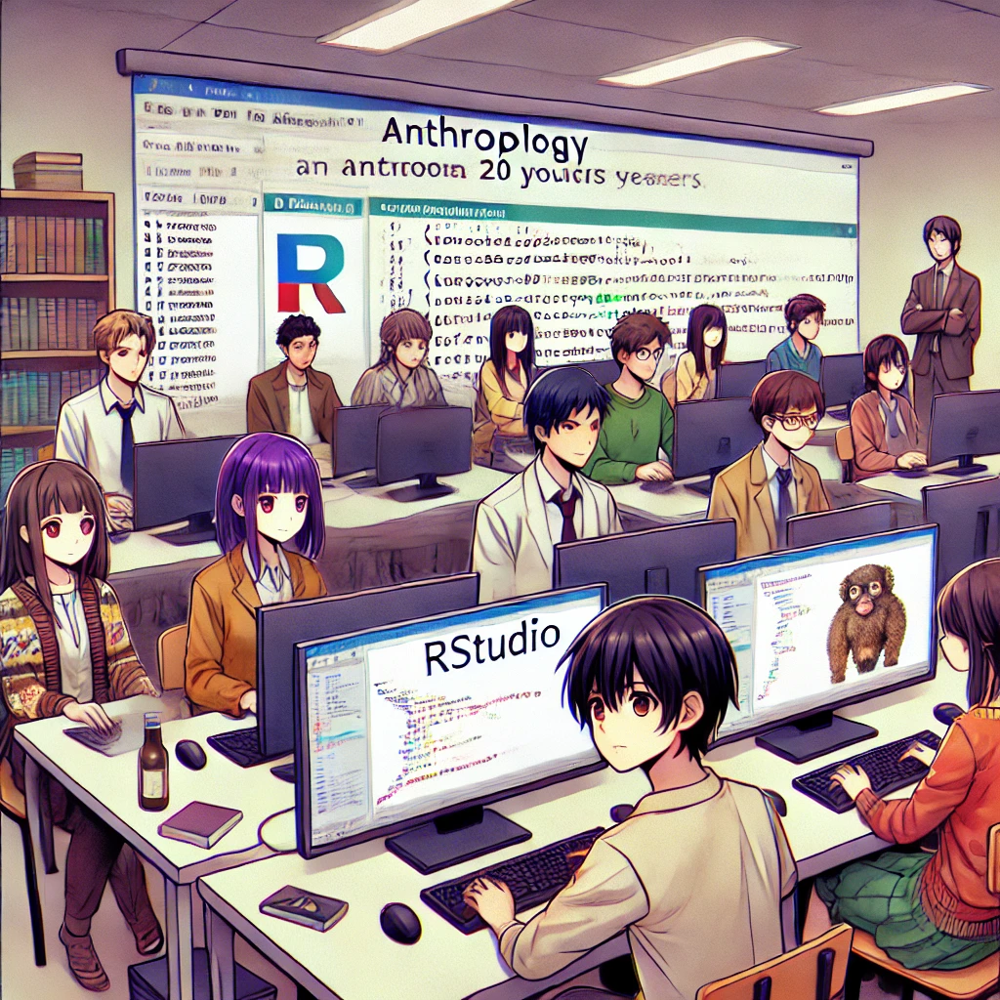

### Bienvenidxs al curso de Métodos Cuantitativos I de la carrera de Antropología en la Universidad Alberto Hurtado.

### Equipo Académico

| Profesor           | email                       | 
|--------------------|-----------------------------|
| Sebastián Muñoz    | semunoz@uahurtado.cl  |

| Ayudante           | email                       |
|--------------------|-----------------------------|
| Matías Álvarez     | maalvarr@alumnos.uahurtado.cl |

A continuación, podrán descargar el programa y programación del curso.

Programa: [`[Programa]`](https://sebastianmunozt.github.io/metodoscuanti1/files/programa_2024.pdf) 

Programación: [`[Programación]`](https://sebastianmunozt.github.io/metodoscuanti1/files/programacion_2024.pdf) 

---
## Descarga e instalación de R y RStudio

- Descargar e instalar `R`: [`[Cápsula]`](https://youtu.be/URtP9Qo2Trw?si=6BCceJEx7f6sXduZ) 
- Descargar e instalar `RTools`: [`[Cápsula]`](https://www.youtube.com/watch?v=Re3DqxM_f2k)

---
## Calendario Clases

Nota: Todas las clases son presenciales, a continuación pueden ver las presentaciones de las clases.

| n°   | Fecha              | Contenido                                                                                                           | Material                                                                                                                                                                |
|------|--------------------|---------------------------------------------------------------------------------------------------------------------|-------------------------------------------------------------------------------------------------------------------------------------------------------------------------|
| 1    | 20-8-2024          | Presentación curso, acuerdos e introducción a ISCUAN                                                                | [`Clase1`](https://sebastianmunozt.github.io/metodoscuanti1/clases/clase_01/clase_01.pptx) · [`Podcast`](https://open.spotify.com/episode/1wfPRgAwDE8cuL6QEbFpoD?si=acab1ae7d486474a)                          |
| 2    | 27-8-2024          | Diseño cuantitativo                                                                                                 | [`Clase2`](https://sebastianmunozt.github.io/metodoscuanti1/clases/clase_02/clase_02.pptx) · [`Podcast`](https://open.spotify.com/episode/14Fv1pq5NHGezr7f5JtnXN?si=d9dd1d6e9bc9401d)                         |
| 3    | ONLINE - Vía Cápsula| R: Introducción y RStudio                                                                                           | [`Clase3`](https://sebastianmunozt.github.io/metodoscuanti1/clases/clase_03/clase_3#1) · [`.R`](https://sebastianmunozt.github.io/metodoscuanti1/clases/clase_03/clase_3.R) · [`Ver`](https://www.youtube.com/playlist?list=PLt-P_DkeQXb9v5mrDk8U9C3IEPoA-XbZ7) · [`Podcast`](https://open.spotify.com/episode/1YISa3Lbc1F7UxUItiLGAr?si=e829fcda981b4920) |
| 4    | 03-9-2024          | Problematización y búsqueda bibliográfica                                                                           | [`Clase4`](https://sebastianmunozt.github.io/metodoscuanti1/clases/clase_04/clase_04.pptx) · [`Podcast`](https://open.spotify.com/episode/66CaugyJfKRXr3IXLE6aPF?si=a93bdb197ed24e7e)                        |
| 5    | 07-9-2024          | R: proyectos, paquetes, funciones, bases de datos                                                                   | [`Clase5`](https://sebastianmunozt.github.io/metodoscuanti1/clases/clase_05/clase_05#1) · [`.R`](https://sebastianmunozt.github.io/metodoscuanti1/clases/clase_05/clase_05.R) · [`Fuentes`](https://sebastianmunozt.github.io/metodoscuanti1/clases/clase_05/Fuentes/Fuentes.rar) · [`Rúbrica y Preguntas Prueba`](https://sebastianmunozt.github.io/metodoscuanti1/clases/clase_05/PreguntasOrientadoras.pdf) · [`Podcast`](https://open.spotify.com/episode/0tODNy7kRhHC2MzgMNZnV7?si=4c00e4c7c8e548d0)                       |
| 6    | 24-9-2024          | Prueba 1: (a) Introducción a la investigación cuantitativa, el diseño, el lugar de la teoría; (b) Introducción a R, tipos de objetos, proyectos, paquetes, funciones, manejo de base de datos | Pendiente                                                                                                                                                              |
| 7    | 01-10-2024         | Operacionalización, tipos de estudios                                                                               | [`Clase7`](https://sebastianmunozt.github.io/metodoscuanti1/clases/clase_07/clase_07.pptx) · [`Podcast`](https://open.spotify.com/episode/1rFGbDsAtSHwNZPCoVAfKf)                                             |
| 8    | 15-10-2024         | Técnicas de producción de datos: Encuestas                                                                          | [`Clase8`](https://sebastianmunozt.github.io/metodoscuanti1/clases/clase_08/clase_08.pptx) · [`¿De quién es?`](https://sebastianmunozt.github.io/metodoscuanti1/clases/clase_08/dequienes.pdf) · [`Podcast`](https://open.spotify.com/episode/4d4OZbmDFcafup6dRH3rfc?si=bb8773030ee04ef0) |
| 9    | 22-10-2024         | Índices y escalas                                                                                                   | [`Clase9`](https://sebastianmunozt.github.io/metodoscuanti1/clases/clase_09/clase_09.pptx) · [`Podcast`](https://open.spotify.com/episode/54nJgA0yq66eecLoVfalVo?si=a102b99743fa4f17)                        |
| 9,5  | 25-10-2024         | **Entrega Intermedia**: Marco Teórico y Metodológico, operacionalización                                             | Pendiente                                                                                                                                                              |
| 10   | 29-10-2024         | R: Exploración, guardar base y `tidyverse`                                                                          | [`Clase10`](https://sebastianmunozt.github.io/metodoscuanti1/clases/clase_10/clase_10#1) · [`.R`](https://sebastianmunozt.github.io/metodoscuanti1/clases/clase_10/clase_10.R)                                |
| 11   | 05-11-2024         | R: Estadística descriptiva y `ggplot`                                                                               | [`Clase11`](https://sebastianmunozt.github.io/metodoscuanti1/clases/clase_11/clase_11#1) · [`.R`](https://sebastianmunozt.github.io/metodoscuanti1/clases/clase_11/clase_11.R)                                |
| 12   | 12-11-2024         | Repaso general Prueba                                                                                               | Pendiente                                                                                                                                                              |
| 13   | 19-11-2024         | Prueba 2: (a) Operacionalización, encuesta, cuestionario; (b) `tidyverse` y `ggplot`                                | [`Script de Repaso`](https://sebastianmunozt.github.io/metodoscuanti1/clases/3/script_repaso.R)                                                                                       |
| 14   | 26-11-2024         | Tutorías Obligatorias                                                                                               | [`Instrucciones`](https://sebastianmunozt.github.io/metodoscuanti1/clases/clase_14/01_Instrucciones.docx) · [`Rúbrica`](https://sebastianmunozt.github.io/metodoscuanti1/clases/clase_14/02_Rubrica.docx)    |
| 15   | 03-12-2024         | **Entrega Grupal Final**: presentación de investigación en clases y entrega de trabajo                              | [`Podcast`](https://open.spotify.com/episode/6g3oG5X2siF6USSzb2L6j7?si=c7603b0308034847)                                                                                    |

---
## Bibliografía por clase

Deberá leer la bibliografía correspondiente para cada clase, la cual está [`[Aquí]`](https://docs.google.com/spreadsheets/d/1zBUMH98qO25tHSWfKVzr9Hxc3JOhj_hXAKpcQEm27Jw/edit?gid=0#gid=0) 

---

## Calendario Ayudantías
Nota: En general las ayundantías son online, a excepción de algunas con Matías

| n°   | Fecha       | Contenido                                                                      | Material   |
|------|-------------|-------------------------------------------------------------------------------|------------|
| 2,5  | 29-8-2024   | Ayudantía 1: Gestión del tiempo en la vida académica: GTD, MT, Pomodoro y Calendario | [`PPT`](https://sebastianmunozt.github.io/metodoscuanti1/ayudantias/ayudantia_01/presentacion#1) · [`Materiales`](https://sebastianmunozt.github.io/metodoscuanti1/ayudantias/ayudantia_01/materiales/materiales.rar) · [`Bibliografía`](https://sebastianmunozt.github.io/metodoscuanti1/ayudantias/ayudantia_01/bibliografia/bibliografia.rar) · [`Ver`](https://youtu.be/nIHVN8NFBnk)|
| 3,5  | 5-9-2024    | Ayudantía 2: Tener instalado R; Ingresar valores, creación de vectores y tablas: R, RStudio, Rtools | Pendiente  |
| 5,5  | 12-9-2024   | Ayudantía 4: Proyectos, funciones, manejo de base de datos                      | Pendiente  |
| 9,5  | 24-10-2024  | Ayudantía 5: Zotero, Proceso de operacionalización y escritura académica         | [`Ayudantia zotero`](https://sebastianmunozt.github.io/metodoscuanti1/ayudantias/ayudantia_zotero/ayudantia_zotero.pptx)  |
| 10,5 | 31-10-2024  | Ayudantía 6: Tidyverse                                                         | Pendiente  |
| 11,5 | 7-11-2024   | Ayudantía 7: ggplot                                                            | Pendiente  |

---

### Sugerencias y Comentarios Clases, Ayudantías y Evaluaciones

- Aquí, en el siguiente [`[Forms]`](https://forms.gle/VCG7cmr5cr7tryAC7) pueden dejar sus críticas, comentarios o sugerencias. En lo posible que sean  constructivas para que podamos ir mejorando. 
- Los comentarios son anónimos !

 

---
##  Tareas

| n° | Fecha       | Contenido                                                                                                                                  | Link                                                                                                                                      |
|----|-------------|-------------------------------------------------------------------------------------------------------------------------------------------|-------------------------------------------------------------------------------------------------------------------------------------------|
| 1  | 20-8-2024   | Tarea 1: Defina su grupo y traiga dos temas de investigación por grupo                                                                     | [Llenar](https://docs.google.com/document/d/1pzb7SxNylHTOBGxFlS3UGeIbg9CiSH5hJAcYj3L-r4s/edit)                                  |
| 2  | 10-9-2024   | Tarea 2:Seleccionar idea final, problematizar y generar: pregunta, objetivos, hipótesis y relevancia +  Tener instalado R y desarrollar tarea | [Llenar](https://docs.google.com/document/d/1pzb7SxNylHTOBGxFlS3UGeIbg9CiSH5hJAcYj3L-r4s/edit)                                  |
| 3  | 1-10-2024    | Tarea 3: Hacer 2 fichas bibliográficas por persona                                                                                             |  enviar por TEAMS y a: semunoz@uahurtado.cl|
| 4  | 8-10-2024  | Tarea 5: Especificar Marco Teórico y Marco Metodológico: estrategia metodológica, objetivos, supuestos de experimentación                  | [Llenar](https://docs.google.com/document/d/1pzb7SxNylHTOBGxFlS3UGeIbg9CiSH5hJAcYj3L-r4s/edit)                                  |
| 5  | 29-10-2024  | Tarea 6: Traer preguntas de cuestionario y digitalizarlas en Google Forms                                                                  |         enviar por TEAMS y a: semunoz@uahurtado.cl                         |

---
## Asistencia

Para ver su asistencia dirijasé al siguiente [`[link]`](https://docs.google.com/spreadsheets/d/13qtu0yAMlowjeUMoUq33Q598Csn1ncsjYzsVEAmYwzw/edit?usp=sharing)

Recuerde puede faltar a 8 bloques! y debe ir a al menos a 3 Ayudantías!

---
## Grupos de trabajo

| Grupo | Tema                               | Nombre   | Apellido      |
|-------|------------------------------------|----------|---------------|

#### Bibliografía del curso

- **R for Data Science** (Hadley Wickham & Garrett Grolemund) [`[e-Book]`](https://r4ds.had.co.nz/)

**Básica**

- [`[Canales (2006) Metodologías de investigación social - Leer textos de Asun! ]`](https://sebastianmunozt.github.io/metodoscuanti1/bibliografía/basica/2006Canales.pdf)
- [`[Boccardo y Ruiz (2019) RStudio para Estadística Descriptiva en Ciencias Sociales]`](https://sebastianmunozt.github.io/metodoscuanti1/bibliografía/basica/2019BoccardoRuiz.pdf)
- [`[Lemieux (2010)]`](https://sebastianmunozt.github.io/metodoscuanti1/bibliografía/basica/2010Lemieux.pdf)
- [`[Hernandez, Sampieri y Torres (2018)]`](https://sebastianmunozt.github.io/metodoscuanti1/bibliografía/basica/2018HernandezSampieriTorres.pdf)
- [`[Marradi, Archenti, Piovani (2007)]`](https://sebastianmunozt.github.io/metodoscuanti1/bibliografía/basica/2007MarradiArchentiPiovani.pdf)
- [`[Sautu, Bonolio, Dalle (2005)]`](https://sebastianmunozt.github.io/metodoscuanti1/bibliografía/basica/2005SautuBonoloiDalle.pdf)

**Complementaria**

- [`[Imai, K. (2018). Quantitative social science: an introduction. Princeton University Press]`](https://metodoscuantitativos.github.io/mc2/bibliografía/complementaria/Imai-(2008)-Quantitative-Social-Science-An-ntroduction.pdf)

- [`[Madrigal L. Frontmatter. In: Statistics for Anthropology. Cambridge University Press; 2012:i-v]`](https://metodoscuantitativos.github.io/mc2/bibliografía/complementaria/Lorena-Madrigal-Statistics-for-Anthropology-Cambridge-University-Press-(2012).pdf) 

- [`[Harvey, G. (2016). Excel 2016 for dummies. John Wiley & Sons]`](https://metodoscuantitativos.github.io/mc2/bibliografía/complementaria/Para-Dummies-Greg-Harvey-Excel-2016-para-Dummies-Para-Dummies-2017.pdf)

**Optativa**

- [`[Howard s. Becker - Datos, pruebas e ideas-Siglo XXI (2018)]`](https://metodoscuantitativos.github.io/mc2/bibliografía/optativa/Howard-Becker-Datos-pruebas-e-ideas-Siglo-XXI-(2018).pdf)

- [`[Joel (2004) Uso y Abuson de Las Estadisticas]`](https://metodoscuantitativos.github.io/mc2/bibliografía/optativa/Joel(2004)-Uso-y-Abuson-de-Las-Estadisticas.pdf)

- [`[D'Ignazio y Klein (2020) Data Feminism-MIT Press]`](https://metodoscuantitativos.github.io/mc2/bibliografía/optativa/D'Ignazio-y-Klein-(2020)-Data-Feminism-MIT-Press.pdf)
 
- [`[Sevilla (2005) Gramática de los gráficos]`](https://metodoscuantitativos.github.io/mc2/bibliografía/optativa/Sevilla-(2005)-Gramática-de-los-gráficos.pdf)

- [`[Sosa, Walter (2020) Big Data]`](https://metodoscuantitativos.github.io/mc2/bibliografía/optativa/Sosa-Walter-(2020)-Big-Data.pdf)

- [`[AS Checklist for Articles_OSF]`](https://metodoscuantitativos.github.io/mc2/bibliografía/optativa/AS-Checklist-for-Articles-OSF.pdf)

- [`[Belcher Cómo-escribir-un-artículo-académico-en-12-semanas]`](https://metodoscuantitativos.github.io/mc2/bibliografía/optativa/Belcher-Cómo-escribir-un-artículo-académico-en-12-semanas.pdf)

 
