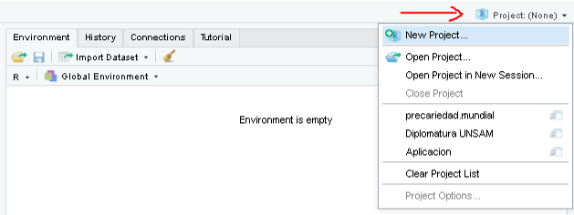
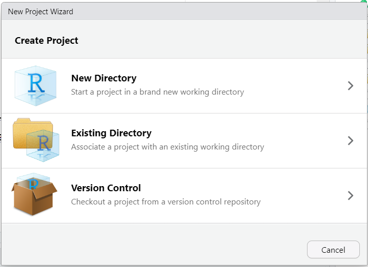
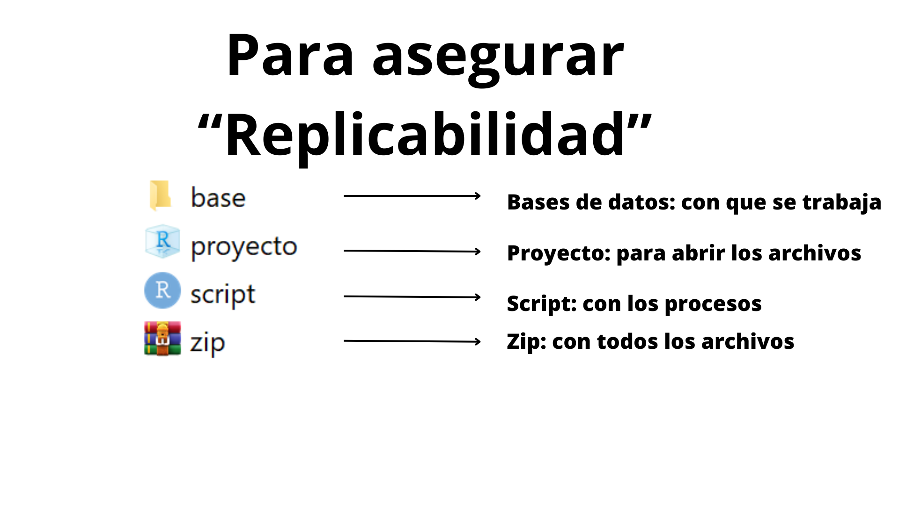

```{r xaringan-themer, include=FALSE, warning=FALSE}

pacman::p_load(xaringan,xaringanthemer,tidyverse, gt,kableExtra )

style_duo_accent(
  primary_color = "#000000",
  secondary_color = "#B40404",
  inverse_header_color = "#FFFFFF"
)

```

## En esta clase


### 1. Repaso

### 2. Data.frame

### 3. Instalación de paquetes

### 4. Proyectos

### 5. Importación


---
class: inverse, center, middle

# 1. Repaso

---

## Instalación del software

* ¿Todos lo tienen instalado?
* ¿Problemas al instalar?
* Ejecutar RStudio

---

- Ventana (1): Editor de Sintaxis
- Ventana (2): “Entorno de Trabajo”
- Ventana (3): Sub-pestañas; Files (Historial de archivos), plots (Gráficos), packages, help - (ayuda)
- Ventana (4): Visualizador de resultados.
---
## Editor de sintaxis
* Estructura y formato de block de notas.
* Permite construir sintaxis sin ejecutar de manera directa (la consola hace eso).
* Funcionalidad de comentarios anteponiendo signo gato (#).
* RStudio tiene función de predecir comandos.
* Se ejecuta con botón “run” o presionando ctrl+enter luego de seleccionar un texto o  al final de la línea.

---

## Consola y visor de resultados
* Si se escriben comandos, cada vez que se apriete enter, se ejecutarán.
* Una vez ejecutados correctamente, queda en azul.
* Si hubo errores queda en rojo y arroja mensajes (¡importantes!).
* También visualiza algunas operaciones. 
* Lo que se visualiza es sólo una “foto”. No queda guardado ni disponible para manipular si no se asigna a un objeto.
* Está listo para operar cuando hay un signo “mayor que” de color azul y luego el cursor titilando.

---

## Entorno y directorio de trabajo

* Memoria interna del programa y uso de memoria RAM.
* Entorno de Trabajo temporal (dura la sesión).
* Uno puede almacenar objetos en la memoria temporal.
* Directorio o carpeta de trabajo.

---

## Tipos de objetos -> Vector
* Almacenamiento contiguo (filas o columnas), tienen una dimensión
* Puede almacenar información numérica, caracteres, valores lógicos (TRUE or FALSE)
Ejemplo:
```{r}
vector_numerico <- c(1, 2, 4, 78, 42, 3, 65)
vector_de_texto <- c("casa", "auto", "bus", "bicicleta")

```
---
## Tipos de objetos -> Factor
* Se trata de un vector que puede almacenar dos capas de información (tiene dos dimensiones): números y letras. 
* Es útil para variables nominales (como género) u ordinales (muy satisfecho, satisfecho, poco satisfecho, muy insatisfecho)


```{r}

genero <- c(1,2,2,2,1,2,1,99,99)
generof <- factor (genero, labels = c("Hombre", "Mujer", NA))

#otra forma
letras <- c("Hombre", "Mujer", NA)
generof2 <- factor (genero, labels = letras)
table(generof2)

```
---
class: inverse, center, middle

# 2. Data frame

---
## Tipos de objetos Bases de datos (Data Frame)

* El elemento data.frame es lo que conocemos como una base de datos: Filas (casos) y columnas (variables) relacionadas entre sí:


---

## Tipos de datos


---

## Lógica y estructura de un comando


* A objeto le asigno el resultado de una acción/proceso (función) …
que se ejecutó sobre un conjunto de datos…
considerando una serie de configuraciones (argumentos: especificaciones de la función)


---

class: inverse, center, middle

# 3. Instalación de paquetes

---

## Paquetes, ¿Qué son y para que nos sirven?

.pull-left[
* Nuevas funciones, bases de datos y objetos de R, complementarios a lo contenido en R Base.

* Aportes de Universidades, investigadores, usuaries y empresas, para expandir las capacidades del lenguaje R y facilitar su uso.]

```{r, echo=FALSE }
knitr::include_graphics("img/travolta.gif")

```
---
## Paquetes, ¿Cómo se usan?

* Podemos descargarlos e instalarlos con el siguiente comando:

```{r, echo=TRUE, eval=FALSE}
install.packages("nombre_del_paquete")
```

* Sólo es necesario instalar el paquete una vez por computadora. Se descargarán de la pagina de CRAN los archivos correspondientes, ubicándose en el directorio donde hayamos instalado el programa.
* Una vez instalado el paquete, cada vez que abramos una nueva sesión de R y querramos utilizar el mismo debemos cargarlo al ambiente de trabajo mediante la siguiente función:

```{r, echo=TRUE, eval=FALSE}
library(nombre_del_paquete)
```

---
## Ejemplos de paquetes

```{r, echo=TRUE, eval=FALSE}
# Para abrir archivos excel
install.packages("openxlsx") # Sólo se instala una vez

#Conjunto de paquetes para limpiar, ordenar, recodificar y graficar datos
install.packages("tidyverse")#Sólo se debe instalar una vez. 

```


```{r, echo=TRUE, eval=FALSE}  
#Abrir librerías (cada inicio de sesión)
library(openxlsx)
library(tidyverse)

```

---
class: inverse, center, middle

# 4. Proyectos
---

## Rproject 

Crear un proyecto de R utilizando RStudio y el archivo .Rproj permite:

* Organización de archivos y directorios (Fácil acceso)
* Aislamiento del entorno de trabajo.
* Esto hace que sea más fácil compartir archivos, porque se comparte el proyecto (fácil replicabilidad)


<div style="text-align:center">
    
</div>

---
## Rproject !

* Para crearlo, vamos al logo de *"nuevo proyecto"* y elegimos la carpeta de trabajo. Cuando trabajemos con proyectos
    - El directorio de trabajo siempre toma como punto inicial la carpeta donde esta ubicada el archivo .Rproj.
    - El *Environment* es específico de nuestro proyecto. No se nos mezclará con resultados de código que podamos correr en otros proyectos.


---
.pull-left[
]

.pull-right[
Siempre al enviar un trabajo, deberá incluir: 
* base de datos 
* proyecto
* script 
* puede hacerlo comprimido en zip]

---



---
# 5. Importación de bases de datos

A la hora de importar una base de datos nos podemos llegar a enfrentar a distintos tipos de archivos. En R contamos con **distintos paquetes y funciones** según el **tipo de extensión** del archivo:    

```{r echo=FALSE}

importacion <- tibble(
  "Tipo de archivo" = c("Texto Plano",
                        "Texto Plano",
                        "Texto Plano",
                        "Extension de R",
                        "Extension de R",
                         "Otros Softwares",
                         "Otros Softwares",
                         "Excel",
                         "Excel"),
           "Paquete" =c("readr",
                        "readr",
                        "readr",
                        "RBase",
                        "RBase",
                        "haven",
                        "haven",
                        "openxlsx",
                        "readxl"),
             "Extension" =c(".csv",
                          ".txt",
                          ".tsv",
                          ".RDS",
                          ".RDATA",
                          ".dta",
                          ".sav",
                          ".xlsx",
                          ".xls"),
         "Funciones" = c("read_csv()",
                           "read_txt()","read_tsv()",
                           "readRDS()", "open()",
                           "read_dta()","read_spss()",
                           "read.xlsx()","read_excel()")    
)  

kable(importacion, format = 'html') %>%
  kable_styling(bootstrap_options = c("striped", "hover")) %>% 
  collapse_rows(columns = 2)
```

---
#Importación de bases de datos

El primer y más importante parámetro de las funciones para importar datos suele llamarse  **`file`**. Allí debemos especificar la ruta hasta el archivo, incluyendo la extensión del mismo. 

Si tenemos abierto un proyecto, el punto de partida para la ruta a especificar será la carpeta del proyecto. Si queremos ir hacia atrás en las carpetas agregamos  **`../`**
```{r eval=FALSE, include=T}
base.vacunas<- read_csv(
  file = "../Fuentes/Covid19VacunasAgrupadas.csv",
  col_names = TRUE, # TRUE si la primera fila tiene nombres de columnas
  n_max = 100)      # Puedo especificar cuantas filas levantar

base.covid <- readRDS(file = "../Fuentes/base_covid_sample.RDS")
```
**IMPORTANTE**: Siempre que lean bases de datos asignarlas a un nuevo objeto. De lo contrario, las va a mostrar completas en consola y no


---
#buscar bases de datos

```{r eval=FALSE, include=T}
base.vacunas<- read_csv(file = "")      
```

- búsqueda comenzará desde donde se sitúa el proyecto 


---
#buscar bases de datos

```{r eval=FALSE, include=T}
base.covid <- readRDS(file = "")
```


---


---
class: inverse, center, middle

# Vamos al programa…

---


